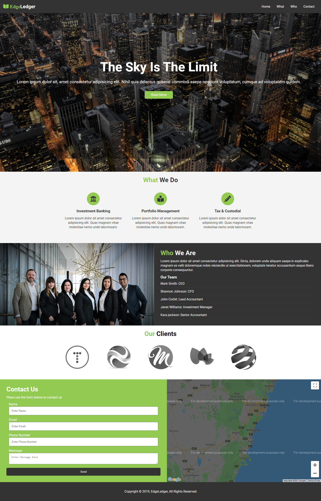

# EdgeLedger-Practice-Page
Fictional Site for practicing HTML/CSS/JS 

Another practice Project to get a good grasp of HTML CSS and Javascript for designing Websites and Landing pages.

What I learn
1. Used Flex to understand how easy it is to use flex to save a lot of effort
2. How efficient it is to use flex compare to float
3. Coding clean and efficently
4. Code resuability

## UPDATE
1. Added contact and footer section
2. Added smooth scroll using js animate function
3. Added Google map 
4. Added responsiveness for Mobile and tablet devices

## For Tablet

## For Mobile Devices

